# HoneyMoney — Knowledge-Graph Gallery

**One graph, six views, five lenses, three personas.** Every image below is a real
screenshot of the live app (`/graph`) over the seeded demo data. The point this gallery
makes to judges: HoneyMoney isn't a ledger with charts bolted on — a household's money
is modelled as a **knowledge graph** (income → buckets → spend → goals), and the *same*
graph re-renders six ways, filters through any lens, and serves one person, a couple and
a whole family with **zero schema changes**.

> Why this matters for scoring: **Technical (25)** — a real graph model + explainable AI
> surface; **Scalability (15)** — one engine, three personas; **Relevance (20)** —
> Malaysian context throughout (EPF/KWSP, PCB/LHDN, PERKESO, TnG, GrabFood, Shopee).

> Refreshing these: `node scripts/refresh-demo-data.mjs` first (it rolls the seeded
> personas into the current month — otherwise every month-to-date view screenshots
> empty), then re-capture the frames you changed.

---

## 1. Six views of the same graph (The Rahman Household)

The view switcher re-projects the identical underlying graph. Each view answers a
different question.

### 🌊 Sankey — "where does every ringgit go?"
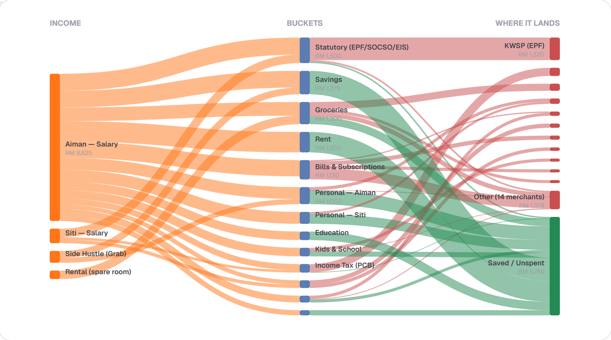
Income (left) splits into buckets (middle), then into real spending (red) versus what
stays **Saved / Unspent** (green). Ribbon width ∝ RM. This is the money-flow story in one
glance — and the exact structure Honey reasons over. Past twelve landing nodes the tail
folds into a single **Other (n merchants)** bar, so the bucket labels stay readable as a
household's vendor list grows.

### 🟦 Treemap — "what's my budget made of, and what's over?"
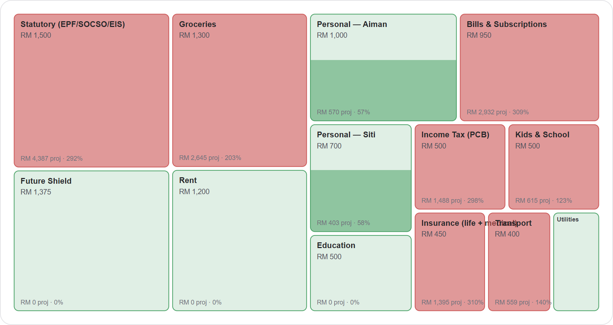
Cell **area ∝ monthly allocation**; **colour ∝ status** (green on-track → red over
budget); the solid fill rises with projected spend. Best for spotting an over-committed
budget at a glance.

### 🌳 Tree — "trace a cost to its source"
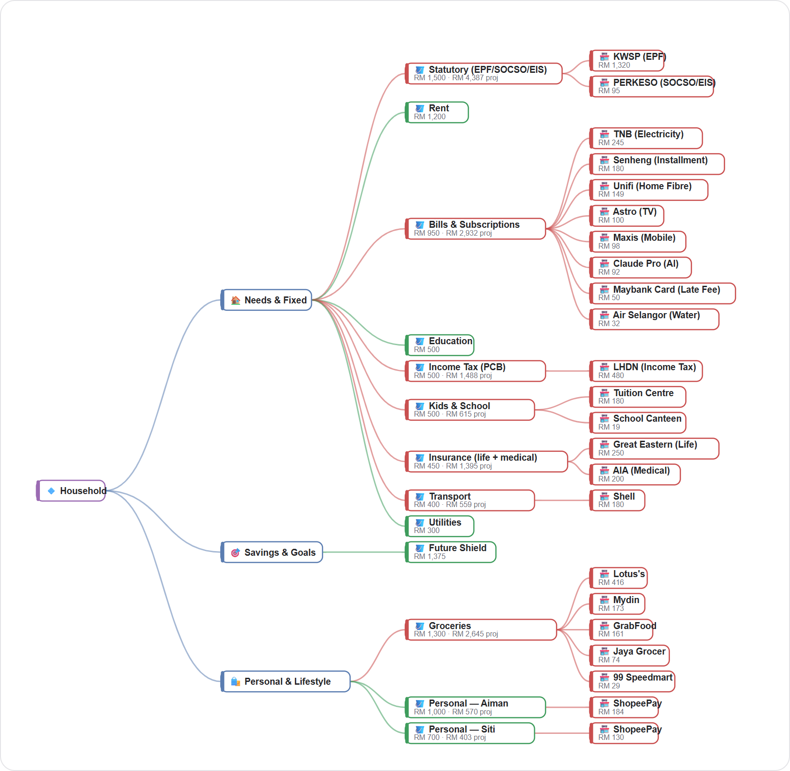
The budget as a branching hierarchy: spending tier → bucket → vendor. Answers "what sits
*under* Groceries?" — the lineage view.

### 🕸️ Organic — "the raw knowledge graph"
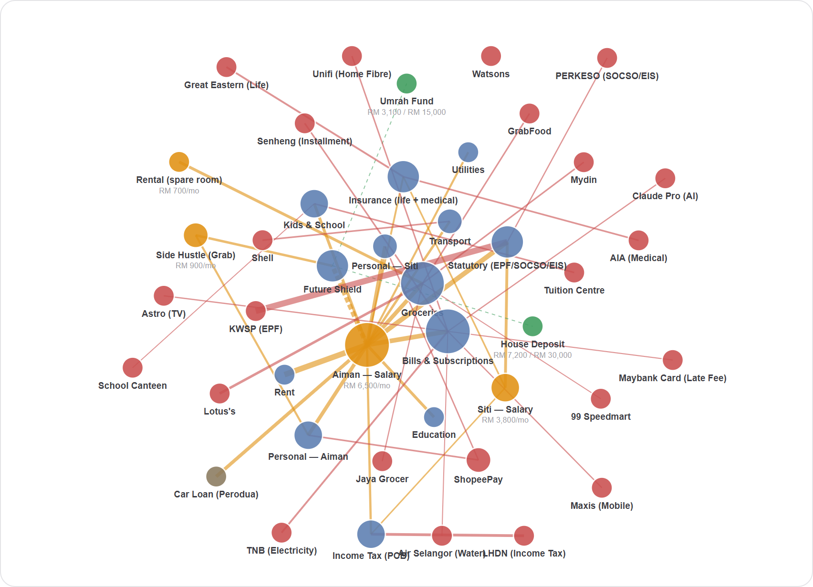
The force-relaxed graph itself. **Node size ∝ number of connections**; amber = income,
blue = buckets, green = goals (e.g. *Umrah Fund RM3,100/15,000*, *House Deposit
RM7,200/30,000*), red = vendors. This is the "there really is a graph under here" proof.

### 📊 Budget — "budget vs actual, directly comparable"
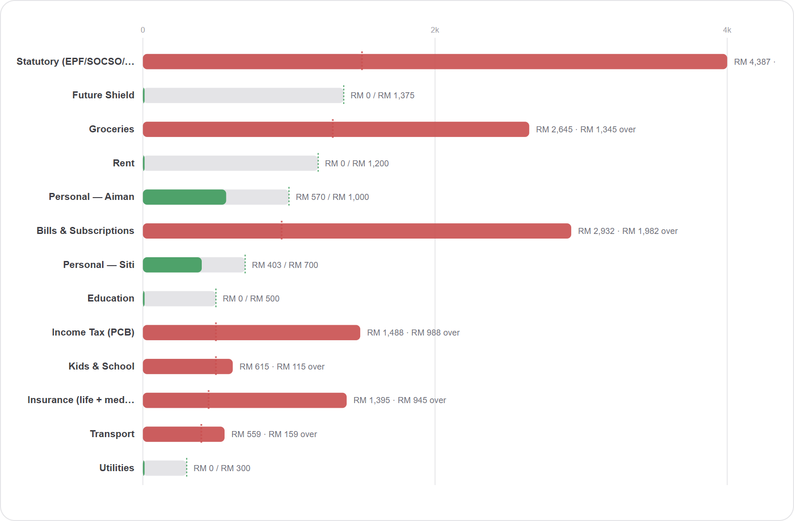
Every bucket on one shared RM scale; the dashed line is the allocation cap. Red bars
(*Bills & Subscriptions RM1,982 over*, *Groceries RM1,345 over*) are the ones bleeding.

### ⇄ Flow — "the classic branch view"
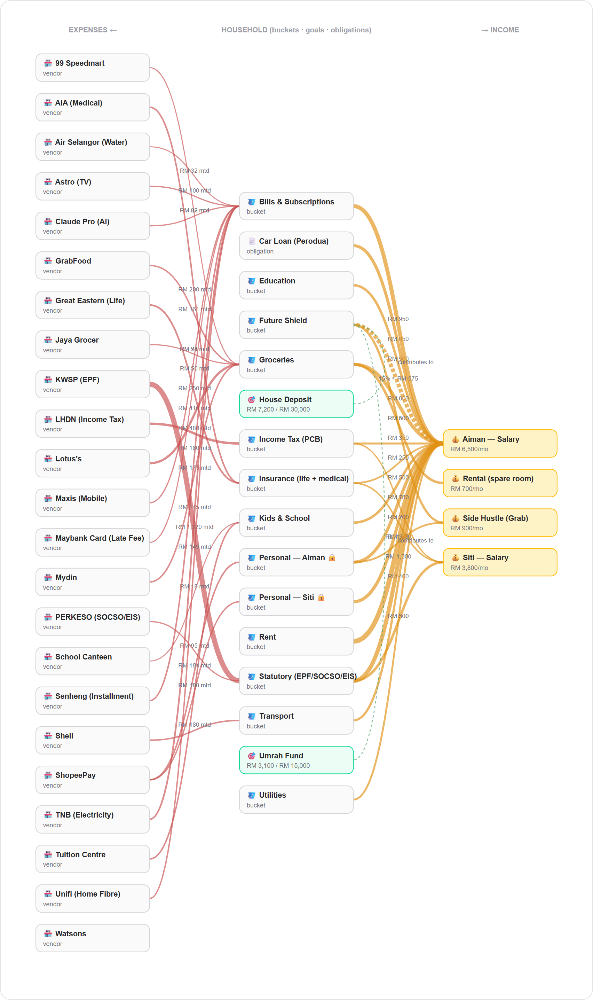
Expenses on the left, household structure (buckets · goals · obligations) in the middle,
income on the right — money reads right → left.

---

## 2. Any node is a lens (focus on one thing)

Pick any person, income stream, bucket, vendor, or category and the **whole page
re-renders through that lens** — KPIs, graph, and captions all refilter.

### 🧑 People lens — one person's money
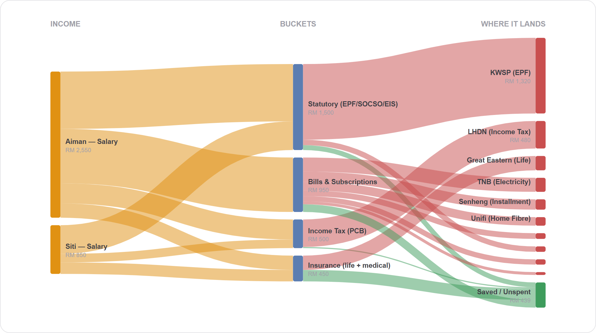
Focus on a single household member: their spend, their envelopes, their vendors — without
exposing anyone else. (This is also the marital-safe boundary: private wallets stay
private.)

### 🏪 Vendor lens — one merchant's lineage
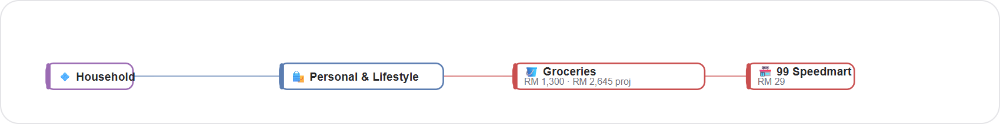
Focus on a single vendor (here **99 Speedmart**) to see which bucket it draws from and how
much — useful for "where is this shop eating my budget?"

### 🗂️ Category lens — one spending tier
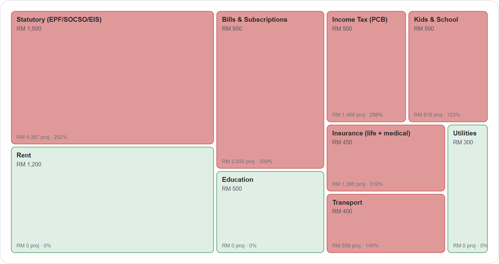
Focus on a category tier (here **essentials / Tier 1**) to isolate non-negotiables from
lifestyle and savings.

---

## 3. One engine, three sizes of household (the scalability story)

Individual → couple → family. The same graph model, the same three buckets, no schema
change — one product that grows with the household instead of three that don't talk to
each other.

### 🧑 Individual — multi-stream freelancer (Aisha)
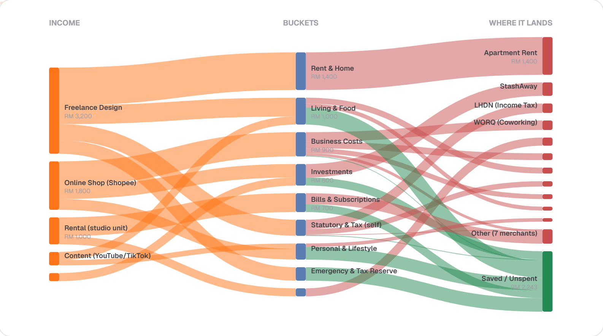
A household of one with **five income streams** — Freelance Design (RM3,200), Online Shop
Shopee (RM1,800), Rental studio (RM1,000), Content YouTube/TikTok — flowing into living,
business costs, investments (StashAway), and a healthy **Saved/Unspent RM2,243**. Proof
the model handles gig / multi-income realities.

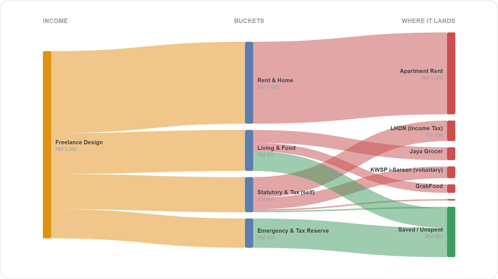
*Income lens on the freelancer:* isolate a single revenue stream (Freelance Design) to
see exactly what it funds.

### 👫 Couple — Nadia & Faiz
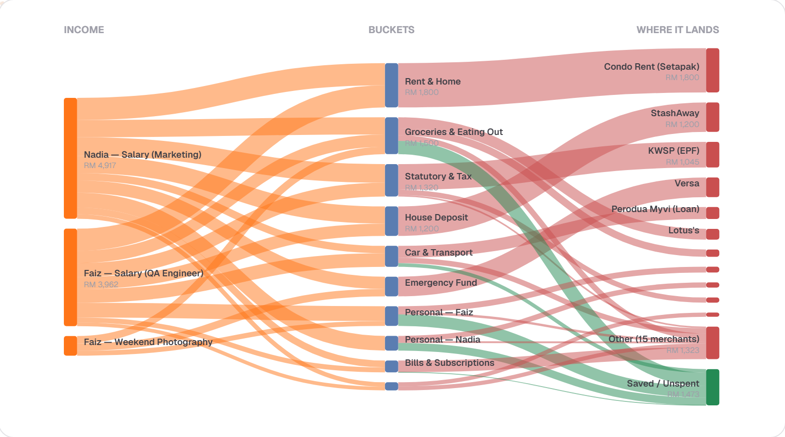
Two salaries plus a weekend side gig fanning into **one shared set of must-paid buckets**
(Rent & Home RM1,800, Statutory & Tax, Bills, Car) — and, at the bottom of the middle
column, **Personal — Nadia** and **Personal — Faiz**: a funded private bucket each.
That pairing *is* the product thesis. Funding transparency where it helps; spending
autonomy where it doesn't.

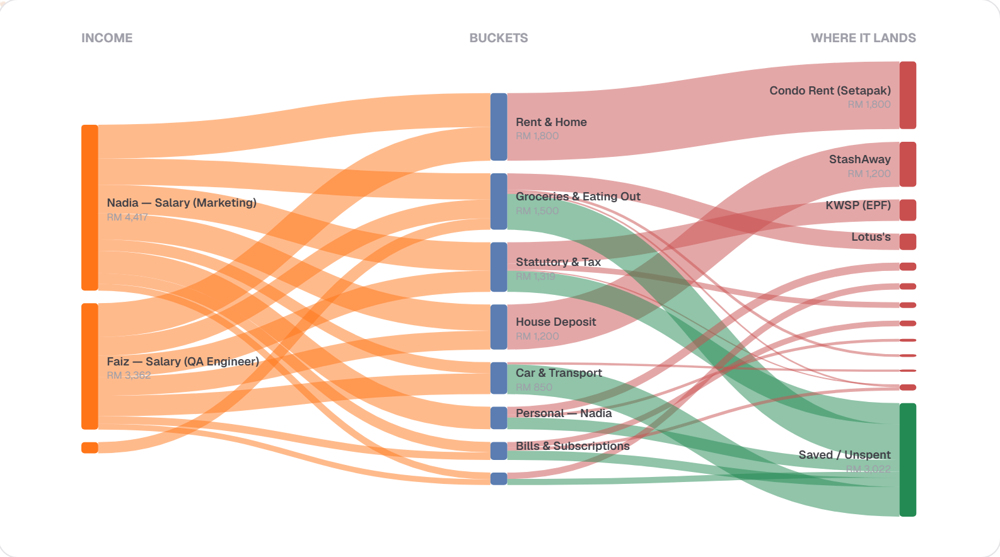
*People lens on one partner:* focus Nadia and the graph re-weights to her money.
**Personal — Faiz** drops out of her view entirely — and in a real (non-demo) household
the redaction goes further: his bucket keeps its **total** so the plan still balances,
but loses its vendor line items. Privacy enforced by the graph, not promised in copy.
See `web/src/lib/privacy.ts`.

### 👪 Family — The Rahman Household
Dual income (Aiman + Siti salaries) plus side hustles and rental, shared goals, four
people. → see all six views in §1 above.

---

## How these were produced

Real screenshots of the running app (`localhost:3000/graph`), captured headlessly and
saved here. To refresh after a data or UI change, re-run the capture (see the scratchpad
`capture_gallery.mjs`) or just re-screenshot `/graph?tenantId=…&mode=…&focus=…` — the page
is fully URL-driven (`mode` = sankey|treemap|tree|organic|bars|flow, `focus` = `all` |
`member:<id>` | `node:<id>` | `tier:<n>`).
